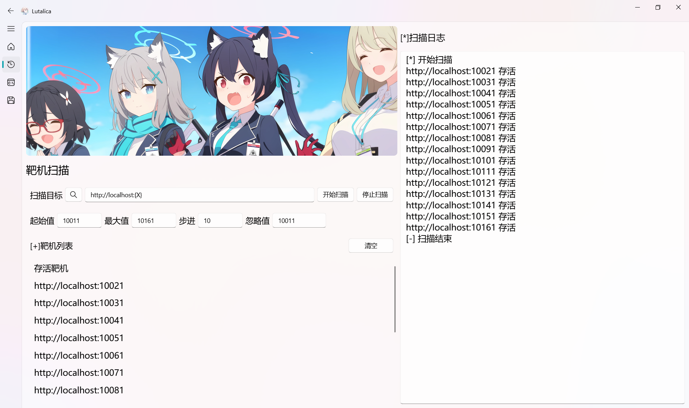
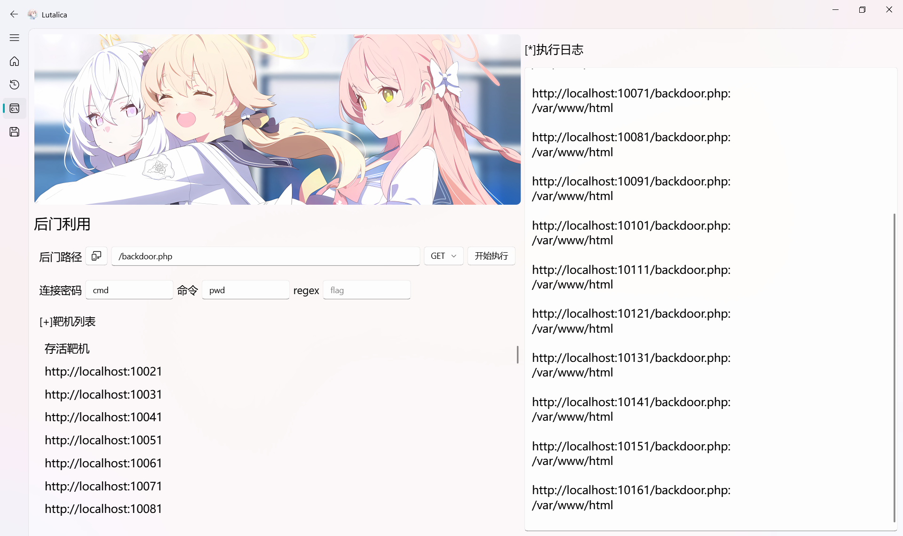

# README

Lutalica 是一个使用 qfluentwidgets 和 PyQt6 构建的网络安全工具。它提供了可视化界面的来扫描网络主机，利用后门，并批量提交数据。

## 主要功能

1. **靶机扫描**：Lutalica 可以扫描指定的 IP 范围，检测哪些主机是活跃的。用户可以自定义起始值、最大值、步进和忽略值，以便精确控制扫描过程。
2. **后门利用**：Lutalica 可以利用已知的后门路径和连接密码，向目标主机发送命令。用户可以自定义命令来利用后门。
3. **批量提交**：Lutalica 可以将收集到的数据批量提交到指定的地址。用户可以自定义提交地址、Content-Type 和
   Authorization，以便满足不同的提交需求。

## 使用方法

1. 在 "靶机扫描" 界面，输入扫描目标、起始值、最大值、步进和忽略值，然后点击 "开始扫描"。
2. 在 "后门利用" 界面，选择活跃的主机，输入后门路径、连接密码和命令，然后点击 "开始执行"。
3. 在 "批量提交" 界面，输入提交地址、Content-Type 和 Authorization，然后点击 "开始提交"。

## 依赖

- qfluentwidgets
- PyQt6
- requests

## 编译

```shell
pip install pyinstaller
pip install pillow
pyinstaller main.spec
```

## 注意事项

Lutalica 仅供学习和研究使用，禁止用于非法活动。使用 Lutalica 产生的任何后果，开发者不承担任何责任。

## 贡献

欢迎任何形式的贡献，包括但不限于提交问题、提供解决方案、改进代码等。
